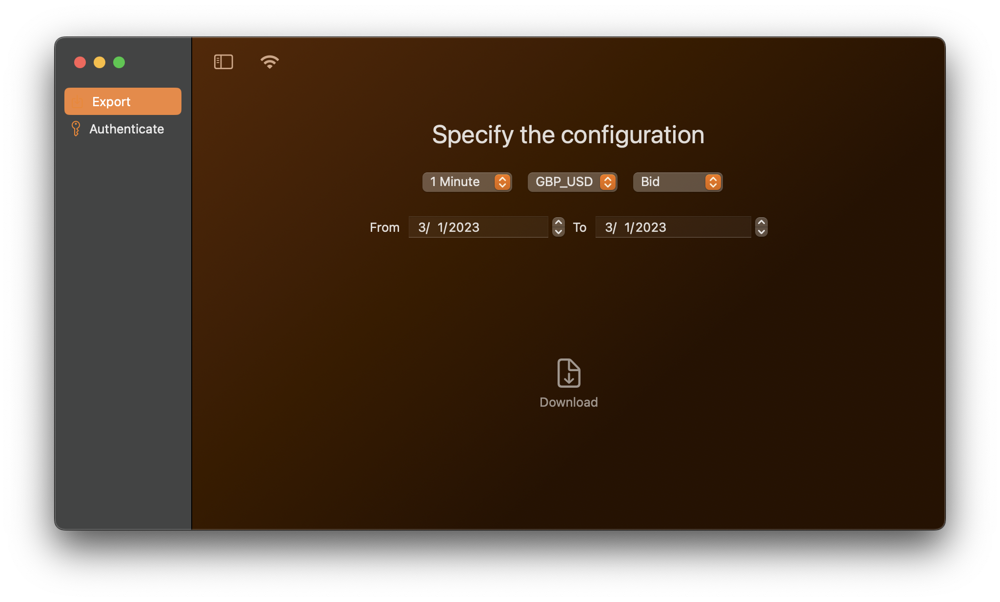
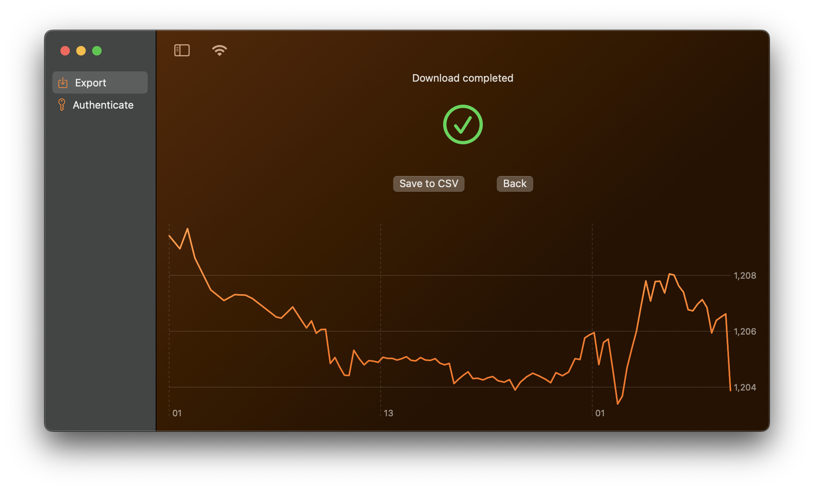

    

# OandaChandler 🕯️

This is a simple candlestick downloading app based on Oanda's REST API. It is designed to do the one job and that is to download candlestick data in a CSV format. You can specify the date range, granularity, and the instrument. You need to provide your Oanda API key in order to use this app.

> **Warning** The app is available only for **macOS**.

    

This app integrates well with [FXTester](https://fxtester.com/). You can import downloaded data into FXTester. Given the fact that it produces rather easy format to modify - you can also use it to download data for your own custom backtesting app.

    

